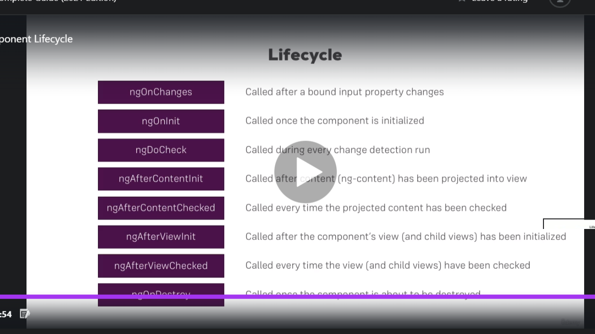
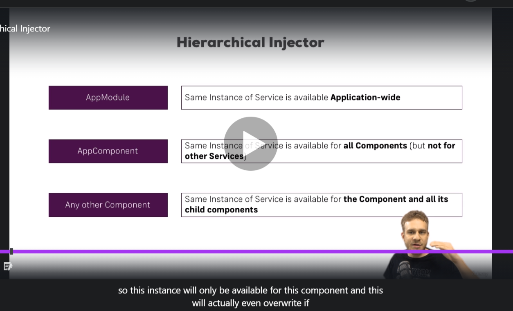

# Angular note

NhanNguyen

some little note by myself to remind what did i learn

---

## Things worth to review:

| No. | Content                                                               |
| --- | --------------------------------------------------------------------- |
|     |                                                                       |
| 1   | [Overview - Basic](#section-01-the-basic)                             |
|     | [Data Binding](#data-binding)                                         |
|     | [Directive](#directive)                                               |
| 2   | [Component Communication](#component-communication)                   |
|     | [UserRef-Reference to HTML Element](#reference)                       |
|     | [ngOnInit](#ngOnInit)                                                 |
| 3   | [Directive Dive Deeper](#section-07-directive-dive-deeper)            |
|     | [Create your own Directives](#your-own-directive)                     |
|     | [Structural Directive](#structural-directive)                         |
| 4   | [Services & Dependency Injection](#services-and-dependency-injection) |
|     | [Hierarchical Injector of Dependency Injector](#hierachical-injector) |
| 5   | [Routing](#routing)                                                   |
|     | [Route params](#route-params)                                         |
|     | [Route Observable](#route-observable)                                 |
|     | [Query Params](#query-params)                                         |
|     | [Nested Route](#nested-route)                                         |
|     | [Handling strange route](#handling-strange-route)                     |
|     | [Protected Route - Guards](#guards)                                   |
| 6   | [Observable - dive deeper](#observable)                               |
| 7   | [Form](#form)                                                         |
| 8   | [Pipes](#pipes)                                                       |
| 9   | [HTTP Requests](#http-requests)                                       |
| 10  | [Authentication](#authentication)                                     |
| 11  | [NgRx](#NgRx)                                                         |

# Section 02 - THE BASIC

`Angular` just only load index.html - and the `ts` file was read first when the application was loaded

`Angular` use `component` to build web functionality - and use `module` to `bundle component` into `packages`

If you want `angular` and `ts` aware one component - you have to `declare` and `import` it in `the module app `

```
@Component({
  selector: 'app-servers',
  templateUrl: './servers.component.html',
  styleUrls: ['./servers.component.scss']
})

Export class ...Component{}
```

`Component` in `Angular` just a Class => You must use `@Component` to make `Angular` recognize this is a `Component`

The `component` and `module` must have a `template` or `templateURL`.

Style can declare as `external file (styleUrls)` or internal file `style`

`Selector` can be another type like attribute (`[app-server]`)or class (`.app-server`). But `best practice` is `app-server` because later angular have `build in attribute selector`

## Interface and Class

`Interface` and `Class` are `blueprint` of the house, we build (implement) the house (by new keyword in class) with this `blueprint` contract

The `contract` meaning we have to declare the `property` or `method` we specify in this `Interface or Class` (if we use `?` operator after property or method => It will become optional)

```
export interface post {
  title: string;
  content: string;
  id?: string;
}
```

## Data binding

### String Interpolation and Property binding

Out put data or logic from TS to HTML

`String Interpolation` is way to binding data from TS to HTML by `{{ expression }}` - remember just only `expression` result in a `string` can pass into `Interpolation` => number will be force into a `string`

`Property binding` is way to binding attribute in HTML tag => dynamic change DOM element when value change

```
<button class="btn btn-success" [disabled]="isTrue">OK</button>
```

### Event binding

React to event that user do in HTML

using `(event without On)` to react to event that user interact with HTML

### Two-way binding

[(ngModal)] will react to change in our `input` and update variable

## Directive

`Directive` is an `instruction` to the `DOM`

Ex: We `directive` / `instruct` where the `component` should place in `template structure`

There are other `directive` built in `Angular` => We use it

`Directive` in `Angular` use `attribute selector` to perform.

### Structural directive

```
<htmlTag *ngIf></htmlTag>
```

=> `*` in `*ngIf` is important because it inform for `Angular` know it will change the DOM. And `directive` it self is ngIf.

### Attribute directive

This does `not add or remove` element like `structural directive`
=> It just change the element

```
[ngStyle]="{backgroundColor: red}"
```

=> `[]`: attribute binding / `ngStyle`: attribute directive

=> We are use `attribute binding` to `bind` a `property` of the `directive`

```
[ngClass]="{ class: condition expression }"
```

=> Dynamic add or remove class

# Section 03

## Model

`Model` is the `blueprint` of object that we use in a lot of place in our app.

`Model` is a `TypeScript class` it be instantiated and defined how the object create based on this setup should look like

=> Like a `blueprint` => Every instances (objects) will create base on this `blueprint`

# Section 05 - Component Communication

## Binding property from parent component to children (@Input) (Lec.67)

We use `@Input decorator` to make `property from child` expose to `parent component`

```
  @Input() element:
    { name: string;
      type: string;
      content: string
    };
```

In parent component we bind `this property` with the `property of parent`

```
<app-server-element
    *ngFor="let element of serverElements"
    [element]="element"
></app-server-element>

```

## Sending an event from child component to parent (@Output) (Lec.69)

We create our `event` in `child component` - and `emit` it to `parent component` with `data`

`$event` is a `protected argument` => It always reference to the same data we pass in the function

## View Encapsulation (Lec.71)

`Angular` made each `css class` have scope to one specific `component`

=> Because each element in HTML template have `unique attribute` of that `component`
=> It make sure only element have that `attribute` will receive the `style` of that `component`

=> `Angular` use technique to `encapsulation` css style

=> You can change default behavior of `encapsulation` in `Angular` by

```
encapsulation: ViewEncapsulation.None
```

## Reference

### By local reference

We use `#` as a reference to HTML node
=> It reference can be use only in `Angular HTML Template`
=> We pass it through `TS File` by function

```
<form>
  <input
    type="text"
    id="name"
    #referenceToName
  />
  <button (click)="onClickHandler(referenceToName)"></button>
</form>

```

=> Our `onClickHandler` function will receive `input` node

### By @ViewChild

```
@ViewChild() ('localReference') nameInput: ElementRef;
```

It create a connection between element and property in `TS File`

=> It will allow us to access `ElementRef.nativeElement` where input value of element place

### By @ViewContent

To `reference` to the `content` that `inject` into our component

## Children Property in Angular

`<ng-content></ng-content>` is a special `hook` in `Angular`

=> It work like `children property` in `React`

## Component LifeCircle in React



`Lec.77` - `Rewatch`

### Constructor

### ngOnchanges

### ngOnInit

This method will run when `component` initialize and `prepare` to appear into the `DOM` => but not into the `DOM`
=>

### ngDoCheck

### ngAfterContentInit

### ngAfterContentChecked

### ngAfterViewInit

### ngAfterViewChecked

### ngOnDestroy

---

---

# Section 07 - Directive Dive Deeper

## Your own Directive

We can create our own `directive` and we `inject` it to our element

`Angular` will `inject` our `directive` to `element` and give us the `reference` to this `DOM NODE`

=> It is `BEST PRACTICE` to use `Renderer2` to access `DOM` because in some circumstances `(services worker)` the DOM `wasn't create` by the browser and access directly to the `DOM` will `cause some bug.`

```
import { Directive, ElementRef, OnInit, Renderer2 } from "@angular/core";

@Directive({
  selector: "[highlightElement]",
})
export class BasicHighLightDirective implements OnInit {
  @Input() defaultColor: string;

  elementRef: ElementRef;
  renderer: Renderer2;
  constructor(elementRef: ElementRef, renderer: Renderer2) {
    this.elementRef = elementRef;
    this.renderer = renderer;
  }

  ngOnInit() {
    this.renderer.setStyle(
      this.elementRef.nativeElement,
      "background-color",
      "green"
    );
  }
}

```

We can also `bind property to directive` like `element` by `placing property in the same place of directive placed`

```
<p highlightElement [defaultColor]="'yellow'"></p>
```

## Structural Directive

### The \* meaning

There is no `*` operator in `Angular`

=> The `*` is just a way to write syntactic sugar code for:

```
<ng-template [ngIf]='condition'>
  <!-- Code Render Conditionally -->
</ng-template>
```

=> It allow us to write \*ngIf inside the element we want to render

---

---

# Section 09 - Services and Dependency Injection

`Services` is where we centralize our code for more purposes - for reuse this code in others component

`Dependency` is what our component depend on

`Dependency Injection` is the way `Angular` provide to us to `inject` `the instances` of `Services Class` into `our component`

=> It will `automatically` create the `instances` of `service class` for us

```
servicesInstance: servicesClass;

constructor( servicesInstance: servicesClass ) {
  this.servicesInstance = servicesInstance;
}

```

=> This snippet above tell `angular` to `what service instances we want`
=> When `angular` create our component => It will know what we want but `not know`hot to give us such `instances`

=> We provide it for `angular`

```
providers: [servicesClass]
```

=> It tell `angular` `how to create this services` - `which instance services we want`

## Hierarchical Injector



If we provide `service` in `Parent Component` it will available in all `Child Component`. And if we still declare it in `Child Component` `Services` will be override.

=> It mean `Parent's Service` and `Child's Service` is no longer the same.

    => Provide `service` in `AppModule` it will be available in all `child component` and `services`

    => Provide `service` in `AppComponent` it will be available in all `child component` but `not services`

## Inject service into service

We have to attach `metadata` to our services, if we want to make it `injectable`

```
import { Injectable } from '@angular/core'

@Injectable()
```

=> It tell `angular` it service can be `injectable`

---

---

# Routing

First step we have to create our `Routes` with `Angular`

```
const appRoutes = [
  {path: 'home', component: HomeComponent}
  {path: 'user', component: UserComponent}
  {path: 'server', component: ServerComponent}
]
```

Second, we have to register our `Route` with `RouterModule`

```
Imports: [RouterModule.forRoot(appRoutes)]
```

Third, we have to tell `Angular` where our `Route` should place by `<router-outlet></router-outlet> directive`

```
<router-outlet></router-outlet>
```

## Router Link === Link

Add a link without reload

<a
routerLink='/home'
[routerLinkOption]="{exact: true}"

> </a>

=> `[routerLinkOption] directive` make page load with `exactly path`

## Relative path and Absolute path in Router Link

### Relative path

<a
routerLink='home'
[routerLinkOption]="{exact: true}"

> </a>

=> It will `continue` of the `current path` => localhost:4200/home/home

### Absolute path

<a
routerLink='/home'
[routerLinkOption]="{exact: true}"

> </a>

=> It will take the `root path` and continue => localhost:4200/home

## Navigating page in our code

=> We use `Router` service => We inject `Router` service into our component

```
constructor(private router: Router)
this.router.navigate(['servers or /servers']) // same result => to localhost:4200/servers
```

NOTE: this route we use in `navigate method` is `relative to root component`, if we want this method to relative to where this method sit in, you have to specify `the component in which navigate method should relative to`

```
constructor(private router: Router, private route: ActivatedRoute)
this.router.navigate(['servers'], {relativeTo: this.route}) // to localhost:4200/servers/servers
```

## Route params

We using `router service` to retrieve `route params`

```
constructor(private router: Router)

ngOnInit(){
  this.routeID = this.router.snapshot.params['id']
}

```

## Route Observable

## Subscribe to change route in same component

Lec.135

If we change `route params` when already in this `route` => we have to `subscribe to that change`, otherwise `Angular` will not recreate variable because we are in this route

```
constructor(private activatedRoute: ActivatedRoute){}
ngOnInit(){
  this.activatedRoute.params.
    subscribe(
      (params:Params)=>{this.id = params['id']}
    )
}
```

=> This is `Observable` (one kind of Promise) but it can unsubscribe.

`UNDER THE HOOD`: `Angular` will unsubscribe it automatically when component be `destroy (unmount)` to reduce memory leak (You have to do it manually in your own Observable)

## Query Params

### Add query params and fragment

In HTML, we bind `[queryParams]` and `[fragment]` to `[routerLink]` directive

```
<a
  [routerLink]="['/servers', 5,'edit']"
  [queryParams]="{allowEdit: 1}"
  fragment='loading'
>
</a>
```

In code, In TS we use `Router Service` to navigate our route

```
constructor(private router: Router)

this.router.navigate(['/server', id , 'edit'], {
  queryParams: {allowEdit: 1},
  fragment: 'loading',
})
```

=> To `access` query params => We use `activatedRoute services` to retrieve through `snapshot` or subscribe to `activatedRoute observable`

```
this.activatedRoute.snapshot.params);
console.log(this.activatedRoute.snapshot.fragment);
```

```
this.activatedRoute.params.subscribe((params: Params) => {
    console.log(params.id);
});

this.activatedRoute.fragment.subscribe((fragment) => {
    console.log(fragment);
});
```

## Children Route and Router Outlet

### Nested Route

Lec.139 - 140

## Handling error and redirect route

### Handling strange route

Lec.140 - 142

## Outsourcing Route Configuration

=> Outsourcing our route config into other `Module` => Help easy to maintain

---

## Guards

### Control to access a route

Lec.146 - Lec.147

We use `canActive & canActivateChild interface` to protect our `route`

Only `canActivate & canActivateChild method` in our `Guard Service` return true in where we defined our `Route` => It will have access to our route

### Control to leave a route

---

---

# Observable

`Observable` like an upgrade version of `Promise`

=> It can `handle asynchronous task` by `subscribe` to it `observable`

Advanced:

- `Observable` can be `subscribe` to an a stream of value from HTTP Respond over time, while `Promise` just only receive only one time.
- `Observable` can `unsubscribe` to an former event - to avoid memory leak.
- `Built-in Observable` is `unsubscribe` by `Angular` - you do not need to do that


## EventEmitter - Subject - Behavior Subject - Observable

### EventEmitter vs. Subject

      Subject.next() does the same like EventEmitter.emit(): It emits an event.

      Angular's EventEmitter extends RxJS' Subject; the implementation differences are not relevant,thus both could be used interchangeably.

      The official docs use ...

      ● EventEmitter in connection with @Output() and event binding in direct child/parent communication, and

      ● Subjects in connection with Subscriptions in cross component communication.

      From a technical point of view this is just a convention. And it's good to follow this convention (even though it might just be based on historical reasons), using different tools for different tasks.

      In this way we can always recognize at first sight in which way the event will be received on the other end (with @Output() and event binding or with a Subscription).

      Important:

      If you would use an EventEmitter with a Subscription, you would have to unsubscribe in the same way like when using a Subject.

### Subject vs. BehaviorSubject vs. Observable

      1.

      Imagine subscriptions to a normal newspaper:

      ● All subscribers get the same edition (same edition number) at the same time.

      ● The first edition a new subscriber gets is the first one which is published after he subscribed - and not edition no. 1, of course.

      ● The publisher publishes his editions regardless of whether there are subscribers (in theory at least).

      This is how RxJS Subjects work.

      2.

      ● Imagine now that additionally each subscriber gets a special welcome present at the time when he subscribes: the latest edition that was emitted before (which implies that there is an initial edition already existent before someone can subscribe).

      This is how RxJS BehaviorSubjects work.

      3.

      Now imagine subscriptions to a personal course.

      ● When someone subscribes, he gets edition no. 1 in the first week after his subscription, edition no. 2 in the second week, and so on.

      ● In this way the subscribers don't get the same edition at the same time. They get the editions depending on their individual date of subscription, and it may even be that they get editions with different personalized tasks.

      ● If no one subscribes, no editions will be emitted.

      This is how RxJS Observables work.

---

### Observable vs BehaviorSubject

https://stackoverflow.com/questions/39494058/behaviorsubject-vs-observable

---

---

# Form

## Template-driven Form

Template driven forms are forms where we write logic, validations, controls etc, in the template part of the code (html code). The template is responsible for setting up the form, the validation, control, group etc.

=> Everything in the template

`Angular FormModule` will construct the object contain key - value pair of input template - and give it for us

`Template-driven` approach is mean that everything you do, you do in the template. Everything you change about this form - you change in the template.

## Reactive Form

`Angular` is autodetecting all form and create a `form object` contain all the information about this form for us (include validation)

In `Template-driven Approach` we use local reference to reference to this `Form` created by `Angular`

In `Reactive Approach` we instruct `Angular` the way to create this `Form Group`

---

---

# Pipes

Is a `function` that `interact` with `our data in HTML Template`

We change our data `before` it appear in HTML but `not directly change property`

There are two type of `pipes`: `built-in` and `custom` pipes

```
import { Pipe, PipeTransform } from "@angular/core";

@Pipe({
  name: "filter",
  pure: false, //Typically, we are not using this property unless we want pipe calculation run every time we change value of input //
})
export class FilterPipe implements PipeTransform {
  transform(value: any, filterString: string, propName: string): any {
    if (filterString.length === 0 || filterString === "") {
      return value;
    }

    return value.filter((item) => {
      return item.status === filterString;
    });
  }
}


```

This is `pile` should look like. We implement `PileTransform interface` and use `transform method` to re-reduce the `current value`

`Pure property: false` meaning we want to re-calculate the pipe every time the value change - default it not re-calc because of costing of performance

---

---

# HTTP Requests

We use `HttpClientModule` to make Http request

`Pipe` to `transform` the data from `firebase` before `subscribe`

```
In Service
  constructor(private http: HttpClient) {}

private getData() {
    return this.http
      .get("https://project-e8993-default-rtdb.firebaseio.com/posts.json")
      .pipe(
        map((data) => {
          const arrayData = [];
          for (const key in data) {
            if (key) {
              arrayData.push({ ...data[key], id: key });
            }
          }
          return arrayData;
        })
      )
  }
```

```
In Component

ngOnInit(){
  this.service.getData().subscribe((data) => {
        console.log(data);
      });
}
```

---

---

# Authentication

## What is authentication?

`Authentication` is a way to `prevent` user access our `data` in server without `JSON Web Token`

When we `login` or do `authentication task`. The server will sent us `Token` and we save that `Token` in `Local Storage`

And every `HTTP Action` sending to server have to have attached that `Token` to `authenticate`

---

JWT: `JSON Web Token` is `encoded string` with a encoded algorithm only back end know how to decode it to ensure the security of our website => No one can access the data without have the permission of our back end

---

---

# NgRx

## NgRx Effect

When we create an effect it will listen to every action we dispatch and filter what action we specify and run asynchronous code, after that:

- In map => it wrap the new action we create in to an observable and automatically dispatch this action
- In catchError => we have to use `of operator` to wrap our newly created action to a new observable
